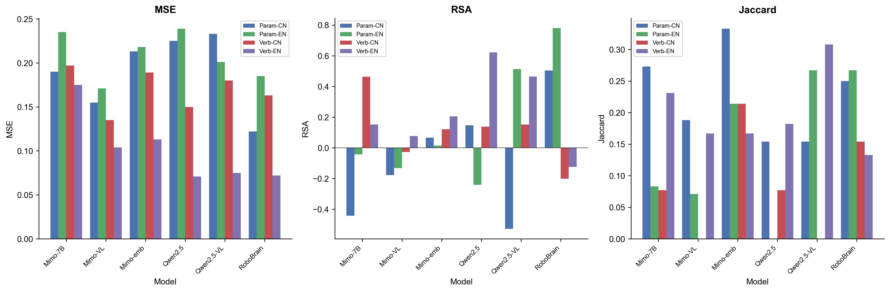
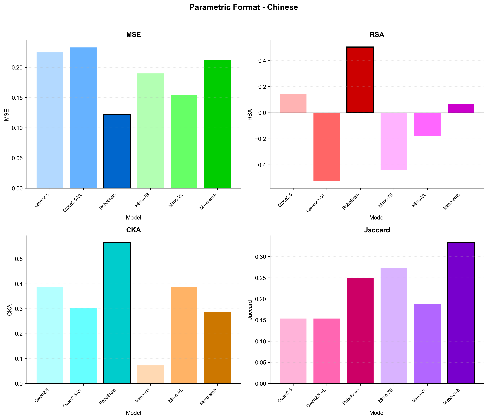
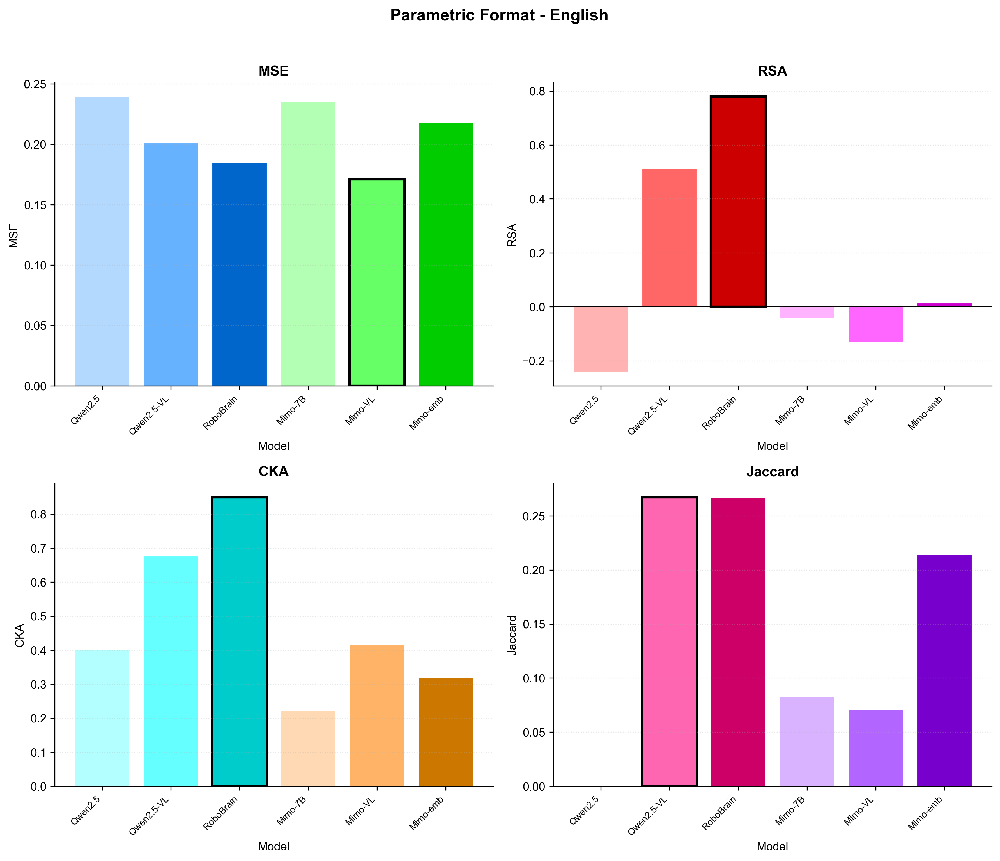
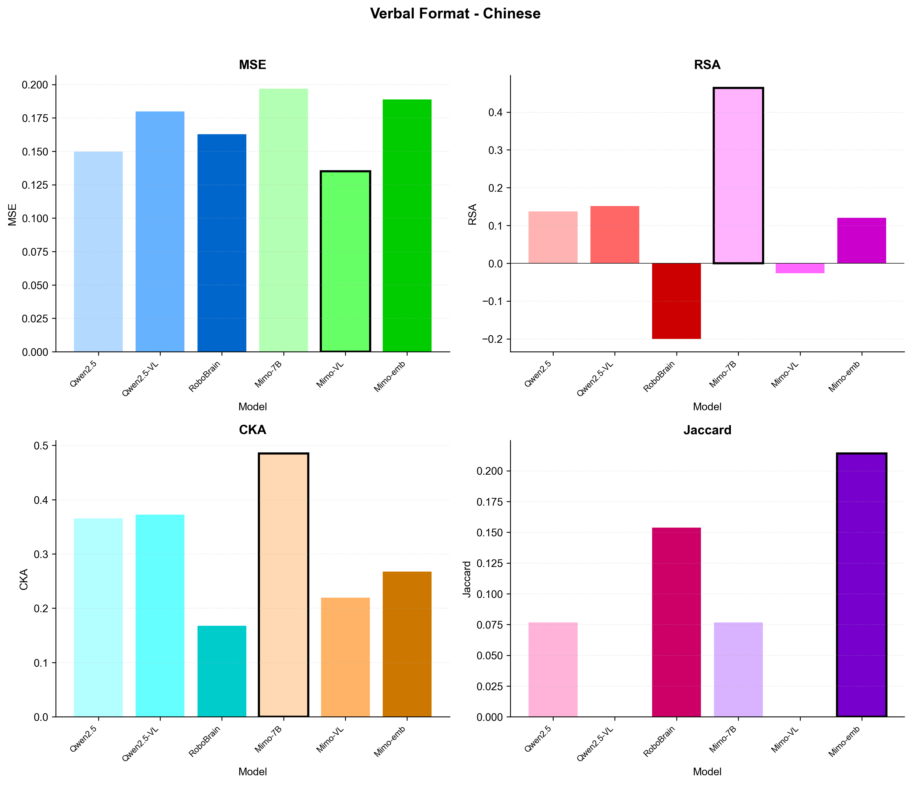
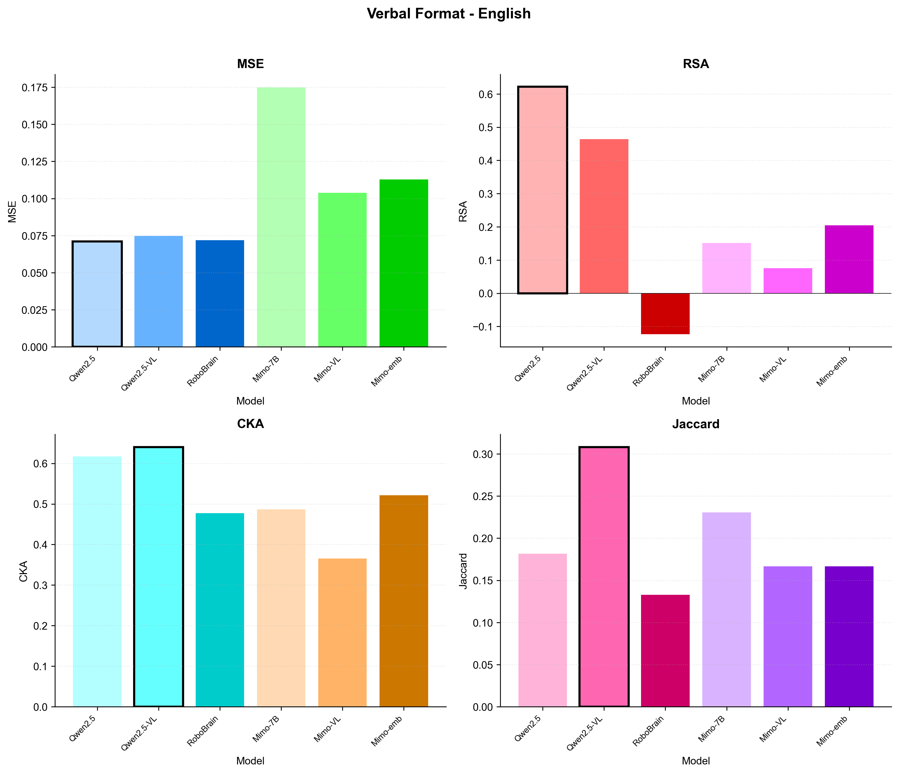
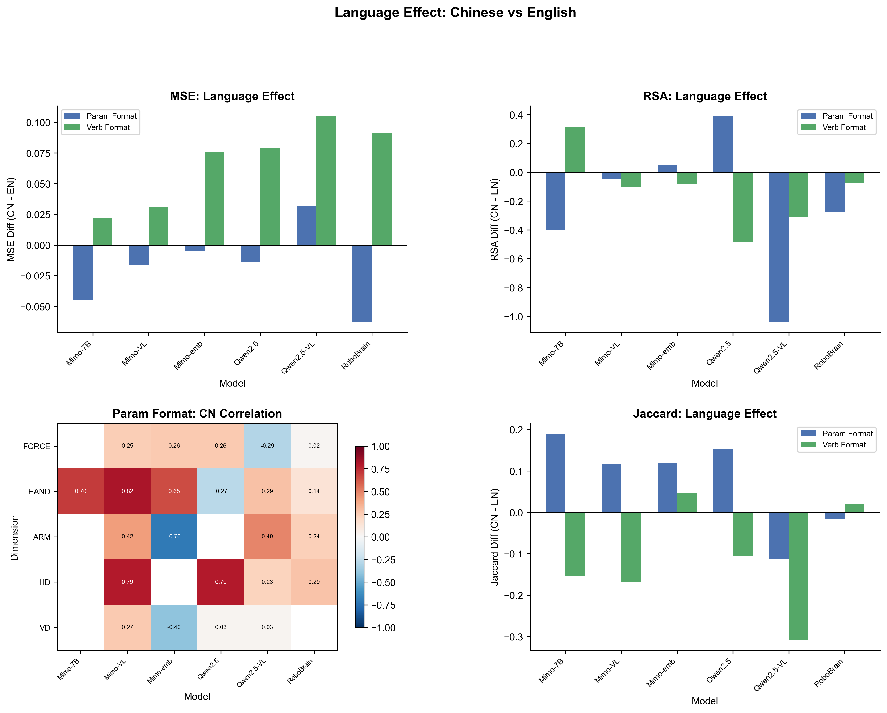
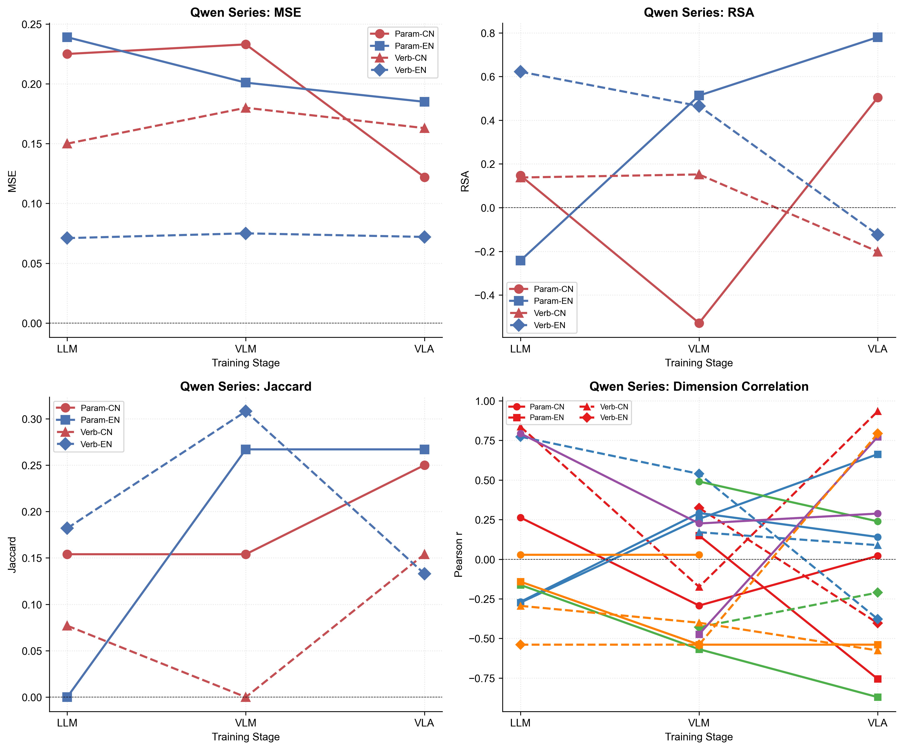
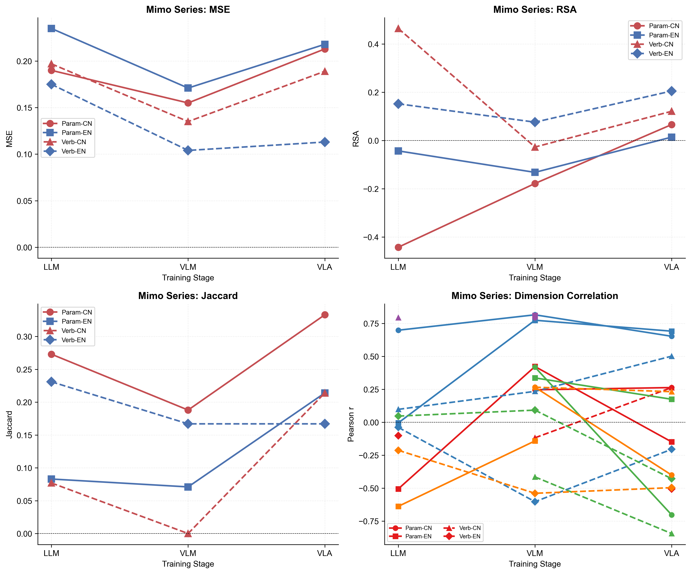

## 项目思路速览

Probing  large model's ability on **Physical Action Verb Synonyms disambiguation(PAVSD)**:

1: Linguistics and cognitive scientists have proved that PA-verb synonyms disambiguation relies on **Verb-Paramaters mapping**, and **can't be solved well by corpus based methods**.

For example, throw, pitch share similar meaninng and trajectory. 

Linguisticsts prove that, we differentiate pitch and throw, not by its 常见搭配组合, but through 运动参数: 手部高度，力度，水平方向，垂直轨迹.

显然，这依赖具身的本体感觉和文化经验。

2: This makes the task an interesting challenge towards large models. Especially raising the question: can visual and action reinforced learning improves LMs ability to build such Verb-Parameters mapping, thus reaching alignment with human?

3: Based on former experience that use "LLM-as-Participant" method, researcher applied similar experience setting on LLMs, VLMs and VLAs, and tested their performance on representing and disambiguating throw verbs.

4: We gathered MSE, RSA, CKA and jaccard similarity to reflect model's performance across two languages and output format.

5: Research shows that all models performs rather bad on the tasks.

.

---

## 详细论述

### 动词同近义词拆分：认知语义学的基本问题

动词同近义词拆分是认知语义学的基本问题。对于这类动词的研究，有如下结论：

**1、动词的理解是具身的**，人类会把动词拆分成和本体感觉（如手举多高）相关的一系列参数

> 无论是enactment还是视频标注都体现了这一点

并且使用这些参数来区分动词里面的同近义词，所以人类对于同近义词肢体动作动词的区分是**具身**而且**结构化**的。

**人类数据（Gao, 2016）**：

| 动词  | 力度 (FORCE)  | 手部高度 (HAND) | 臂姿 (ARM) | 水平方向 (HD) | 垂直轨迹 (VD) |
| --- | ----------- | ----------- | -------- | --------- | --------- |
| 扔   | 3.05 (0.51) | 5.43 (1.82) | 11:18    | 21:8      | 21:8      |
| 丢   | 2.33 (0.83) | 4.63 (1.08) | 6:24     | 16:12     | 23:5      |
| 抛   | 3.16 (0.45) | 6.65 (2.52) | 14:15    | 29:1      | 30:0      |
| 投   | 3.21 (0.52) | 9.13 (0.79) | 30:0     | 30:0      | 29:1      |
| 摔   | 4.55 (0.56) | 8.51 (1.11) | 29:0     | 25:4      | 0:29      |
| 甩   | 3.74 (0.68) | 6.27 (1.49) | 21:8     | 9:20      | 14:15     |

换言之：一个动词，很可能对应的是一系列动词簇中的一个prototype。例如，扔、抛、丢、投、甩、摔都在一个动词簇当中，每一个词汇对应的是一个prototype。这个prototype可以被投射为一些参数特征，例如手的相对高度。

**2、动词本身，不依赖语境，仍然有区别**。例如，扔和丢，投和抛，可能出现在完全相同的语境里面：

- 扔垃圾 vs 丢垃圾
- 投球 vs 抛球

但是他们的语义是完全不同的，且基于大样本语料库的研究方法无法很好的捕捉这种区分特性。反而，依靠人类实验采集到的真实参数，能够很好的区分动词。

**3、这种对动词的理解和文化环境是高度相关的**，体现在：

- 结论和**儿童语言习得相关**
- 结论和**文化高度相关**，因为heritage learner的结论体现了这点
- 不同语言区分不同动词的关键参数是不同的，有**文化特异性**

**4、存在行为实验数据**

### 总结

肢体动作动词的细粒度语义拆分是和**具身认知相关的**、有**文化特异性的**、**去语境的**（尽管这么表达不严谨）、**结构化的**一个复杂认知任务。

### 四点特征带来的意义

- **具身认知特征** → 纯粹的entity-naming的任务是语言习得的，这个任务提供了很好的人机对比的框架，动词存在一种特别的表征体系，这种体系需要通过非语言（non-verbal）的方式来记录（如观察视频判断，enactment），很特别。另外，我们有真实的人类数据，可以直接做人机对比。
- **去语境特征** → 纯粹的语料库不能很好区分细粒度动词，那么LLM与VLM对比，是否能够有明显的提升？这个任务可以直接讨论分布式语义假设是否存在不足
- **文化特异性** → 这个任务提供了跨文化（多语言对比）作为一个衡量指标，模型在不同语言上表现是否有差异？
- **结构化** → 首先，一个动词簇构成了一个认知的具体任务，而不只是对孤立的词汇的测量，更具有效度；其次，提供了多个衡量指标：不同参数的显著性是否一致？结构相似程度有多少？比正确率要更有深度

### 具体研究问题

基于上述的论述，我们的具体RQ可以分为两个部分展开：

- **部分1**：模型能否模仿人类对于同一个动词簇内的同近义词动词的**具身理解**
- **部分2**：模型能否模仿人类对于同一个动词簇内的同近义词动词的**区分判断**

我们尤其关心：

- **RQ1**：LLM和VLM，以及进行了具身训练的VLM这三种模型的表现差异，因为这可能体现了具身训练对于模型的理解能力的影响
- **RQ2**：中文-英文对比情况下模型表现有无差异
- **RQ3**：参数化和语言描述两种输出模式是否会影响模型的能力表现

---

## 为什么问题是有意义的？

1. **弥补了缺失**：VLM的动词理解能力没有被测评过
2. **理论上可行**：模型的训练材料中理论上是可以提取出参数表征的，这样的提取模式并非无法涌现，所以这个问题的答案是有待探索的
3. **安全对齐**：这项研究直接和具身智能的安全对齐关联了起来

---

## 实验设计

### 模型选择

围绕着模型进化的周期选了两组：

- **Mimo系列**：Mimo-7B-SFT → Mimo-VL-7B-SFT → Mimo-embodied-7B
- **Qwen系列**：Qwen2.5-7B-Instruct → Qwen2.5-VL-7B-Instruct → RoboBrain2.0-7B

### 实验设计介绍

完全模仿Helena Gao的研究。提示词示例（任务1，中文）：

```
请按照中文母语者对该动作的相关理解进行简单判断，假设你是一个右利手的中文母语者。

想象你处于一个空旷房间中。
你的面前有一张桌子。
桌面上放置着一个手掌大小的物体。

目标动作：{verb}

请采用你认为最自然、最典型的方式执行该动作。
若存在多种可能的执行方式，请选择最典型的一种。

请根据以下动作编码标准，对该动作进行编码。
请按照FORCE,ARM,HAND,VD,HD五个维度输出编码

FORCE - 执行动作时施加于物体的力量大小
5 = 非常强, 4 = 强, 3 = 中等, 2 = 弱, 1 = 非常弱

ARM - 动作开始前手臂的初始状态
1 = 手臂伸直, 0 = 手臂弯曲

HAND - 动作开始前手部停留的初始高度
0 = 地面高度, 1-9 = 相对高度, 10 = 身高

VD - 执行动作时手部的主要垂直运动方向
1 = 向下, 0 = 向上

HD - 执行动作时手部的主要水平运动方向
1 = 向前, 0 = 向侧方

仅输出一个JSON对象。
```

这与人类实验的对应关系：

- 人类被试被要求在房间中表演出动作 → 模型被要求想象自己执行动作
- 人类行为被编码为五个维度 → 模型直接输出五个维度的编码
- 人类数据来自30名母语者 → 模型数据来自多次采样

---

## 形式化表达

### 动词表征构建

每个动词 $v$ 被表示为5维参数向量：

**公式1：单个动词的参数向量**

$$v = [f, h, a, d_h, d_v] \in \mathbb{R}^5$$

其中：

- $f$：力度（FORCE），归一化到[0, 1]
- $h$：手部高度（HAND），归一化到[0, 1]
- $a$：臂姿（ARM），0=弯曲，1=伸直
- $d_h$：水平方向（HD），0=侧向，1=向前
- $d_v$：垂直方向（VD），0=向下，1=向上

**公式2：6个动词的表征矩阵**

$$X = [v_1, v_2, ..., v_6]^T \in \mathbb{R}^{6 \times 5}$$

其中 $v_i$ 为第 $i$ 个动词的5维参数向量。模型和人类各有一个 $6 \times 5$ 的矩阵。

---

### 结构参数预测能力指标

**公式3：MSE（均方误差）**

$$MSE = \frac{1}{30} \sum_{i=1}^{6} \sum_{j=1}^{5} (X_{ij}^{human} - X_{ij}^{model})^2$$

其中 $X^{human}$ 和 $X^{model}$ 分别为人类和模型的 $6 \times 5$ 矩阵。越低越好，反映模型能否准确预测动词对应的参数值。

**公式4：RSA（表征相似性分析）**

首先计算动词间的距离矩阵：

$$D_{ij} = \|v_i - v_j\|_2$$

其中 $D \in \mathbb{R}^{6 \times 6}$ 为欧氏距离矩阵。

然后提取上三角向量：

$$vec(D) = [D_{12}, D_{13}, ..., D_{56}]^T \in \mathbb{R}^{15}$$

最后计算Spearman相关：

$$RSA(X, Y) = Spearman(vec(D_X), vec(D_Y))$$

范围[-1, 1]，越高越好，反映模型对动词之间相似性关系的理解是否与人类一致。

**公式5：CKA（中心核对齐）**

首先中心化矩阵：

$$X_c = X - \bar{X}, \quad Y_c = Y - \bar{Y}$$

其中 $\bar{X}$ 为 $X$ 的列均值。

然后计算核矩阵（线性核）：

$$K_X = X_c X_c^T, \quad K_Y = Y_c Y_c^T$$

计算HSIC：

$$HSIC(K_X, K_Y) = \frac{1}{(n-1)^2} tr(K_X H K_Y H)$$

其中 $H = I - \frac{1}{n}\mathbf{1}\mathbf{1}^T$ 为中心化矩阵，$n=6$。

最后计算CKA：

$$CKA(X, Y) = \frac{HSIC(K_X, K_Y)}{\sqrt{HSIC(K_X, K_X) \cdot HSIC(K_Y, K_Y)}}$$

范围[0, 1]，越高越好，反映模型的动词表征空间结构与人类的相似程度。

---

### 关键参数识别能力指标

**公式6：动词对的维度差异**

对于每对动词 $(i, j)$，计算各维度的差异：

$$\Delta_{ij}^k = |X_{ik} - X_{jk}|, \quad k \in \{1, 2, 3, 4, 5\}$$

其中 $k$ 为维度索引（FORCE, HAND, ARM, HD, VD）。

**公式7：关键维度集合**

对于每对动词 $(i, j)$，选择差异最大的维度作为关键维度：

$$S_{ij} = \{k | \Delta_{ij}^k > \theta\}$$

其中 $\theta$ 为阈值（本研究使用该对动词在该维度上的平均差异）。

**公式8：Jaccard相似度**

对于每对动词 $(i, j)$，计算人类和模型的关键维度集合的Jaccard相似度：

$$J(S_{ij}^{human}, S_{ij}^{model}) = \frac{|S_{ij}^{human} \cap S_{ij}^{model}|}{|S_{ij}^{human} \cup S_{ij}^{model}|}$$

**公式9：平均Jaccard**

对所有 $\binom{6}{2} = 15$ 对动词取平均：

$$J_{avg} = \frac{1}{15} \sum_{i<j} J(S_{ij}^{human}, S_{ij}^{model})$$

范围[0, 1]，越高越好，反映模型是否使用了与人类相同的关键维度来区分动词。

---

## 实验结论


### 总体表现



上图展示了6个模型在4种条件下（参数-中文、参数-英文、言语-中文、言语-英文）的3个指标表现（MSE、RSA、Jaccard），以及维度相关性热力图。

---

### 一、参数格式-中文条件



上图展示了6个模型在参数格式-中文条件下的MSE、RSA、维度相关性热力图和Jaccard。热力图显示每个模型的5个维度与人类对应维度的Pearson相关系数。

**讨论**：

- **MSE**：RoboBrain最优（0.122），Mimo-VL次之（0.155），Qwen2.5-VL最差（0.233）
- **RSA**：RoboBrain最优（0.504），Qwen2.5次之（0.147），Qwen2.5-VL最差（-0.528）
- **Jaccard**：Mimo-embodied最优（0.333），RoboBrain次之（0.250），Mimo-VL和Qwen2.5-VL最差（0.154/0.188）
- **维度相关**：Mimo-VL在HAND和HD维度上相关较高（0.815, 0.794），Mimo-emb在ARM维度上是负相关（-0.703）

---

### 二、参数格式-英文条件



**讨论**：

- **MSE**：Mimo-VL最优（0.171），RoboBrain次之（0.185），Qwen2.5最差（0.239）
- **RSA**：RoboBrain最优（0.780），Qwen2.5-VL次之（0.513），Qwen2.5最差（-0.242）
- **Jaccard**：RoboBrain和Qwen2.5-VL并列最优（0.267），Qwen2.5最差（0.000）

---

### 三、言语格式-中文条件



**讨论**：

- **MSE**：Mimo-VL最优（0.135），Qwen2.5次之（0.150），Mimo-7B最差（0.197）
- **RSA**：Mimo-7B最优（0.464），Qwen2.5-VL次之（0.152），RoboBrain最差（-0.201）
- **CKA**：Mimo-7B最优（0.485），Qwen2.5-VL次之（0.373），RoboBrain最差（0.168）
- **Jaccard**：Mimo-embodied最优（0.214），RoboBrain次之（0.154），Mimo-VL和Qwen2.5-VL最差（0.000）

---

### 四、言语格式-英文条件



**讨论**：

- **MSE**：Qwen2.5最优（0.071），RoboBrain次之（0.072），Mimo-7B最差（0.175）
- **RSA**：Qwen2.5最优（0.622），Qwen2.5-VL次之（0.465），RoboBrain最差（-0.124）
- **CKA**：Qwen2.5-VL最优（0.640），Qwen2.5次之（0.618），Mimo-VL最差（0.366）
- **Jaccard**：Qwen2.5-VL最优（0.308），Mimo-7B次之（0.231），RoboBrain最差（0.133）

---

### 五、语言影响（中文 vs 英文）



上图展示了同一模型同一格式下，中文与英文的差值（中文 - 英文）。正值表示中文更优，负值表示英文更优。

**讨论**：

- **MSE**：参数格式下5/6模型中文更优（正值），言语格式下所有模型英文更优（负值）
- **RSA**：因模型和格式而异，无一致趋势
- **CKA**：所有模型英文更优（负值），参数格式差异更大
- **Jaccard**：参数格式下4/6模型中文更优（正值），言语格式下4/6模型英文更优（负值）

---

### 六、提示词影响（参数 vs 言语）


上图展示了同一模型同一语言下，参数格式与言语格式的差值（参数 - 言语）。正值表示参数格式更优，负值表示言语格式更优。

**讨论**：

- **MSE**：中文条件下4/6模型言语格式更优（负值），英文条件下所有模型言语格式更优（负值）
- **RSA**：因模型而异，无一致趋势
- **CKA**：中文条件下3/6模型参数格式更优（正值），英文条件下3/6模型言语格式更优（负值）
- **Jaccard**：中文条件下所有模型参数格式更优（正值），英文条件下4/6模型言语格式更优（负值）

---

### 七、模型进化（LLM → VLM → VLA）

#### Qwen系列



**参数格式-中文**：VLA在MSE和CKA上最优，RSA从VLM回升
**参数格式-英文**：MSE持续下降，RSA和CKA持续提升，Jaccard在VLM提升后持平
**言语格式-中文**：LLM在MSE和RSA上最优，VLM在CKA上最优，Jaccard在VLA提升
**言语格式-英文**：LLM在MSE和RSA上最优，VLM在CKA和Jaccard上最优

#### Mimo系列



**参数格式-中文**：VLM在MSE和CKA上最优，RSA持续提升，Jaccard在VLA回升
**参数格式-英文**：VLM在MSE和CKA上最优，RSA在VLA回升，Jaccard在VLA提升
**言语格式-中文**：VLM在MSE上最优，LLM在RSA和CKA上最优，Jaccard在VLA提升
**言语格式-英文**：VLM在MSE和CKA上最优，VLA在RSA上最优，Jaccard在LLM最优

---

### 核心发现

1. **最优组合**：
   
   - 参数格式-中文：RoboBrain（MSE: 0.122, RSA: 0.504, CKA: 0.565）
   - 参数格式-英文：RoboBrain（RSA: 0.780, CKA: 0.849）
   - 言语格式-中文：Mimo-VL（MSE: 0.135）
   - 言语格式-英文：Qwen2.5（MSE: 0.071, RSA: 0.622）

2. **语言影响**：参数格式下中文MSE更优，言语格式下英文MSE更优；CKA普遍英文更优

3. **提示词影响**：言语格式在英文条件下普遍降低MSE，中文条件下参数格式Jaccard更优

4. **模型进化**：Qwen系列VLA训练在英文条件下显著提升（RSA、CKA持续提升），Mimo系列VLM训练效果更优但VLA回升不一致

5. **Jaccard偏低**：所有模型Jaccard<0.333，说明模型与人类维度选择存在较大差异

---

## 研究的问题

1. **提示词控制**：当前提示词控制并没有很精细，如何证明结论在不同提示词模式下的robustness？
2. **模型对比合法性**：目前选择的模型都是LLM-backbone基础上练出VLM，再在VLM基础上训练出VLA。基于训练顺序的LLM-VLM-VLA的训练能力对比 是否
3. **机制分析**：mechanism analysis目前不知道如何下手
4. **规模问题**：当前的动词太少，模型也比较少

## 未来打算

加入可逆性实验（给定动词描述，反推动词），来看这种动词-参数映射是否可靠。
