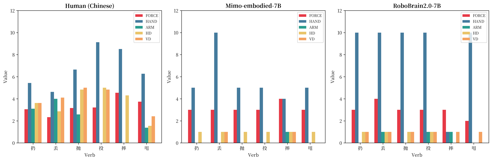
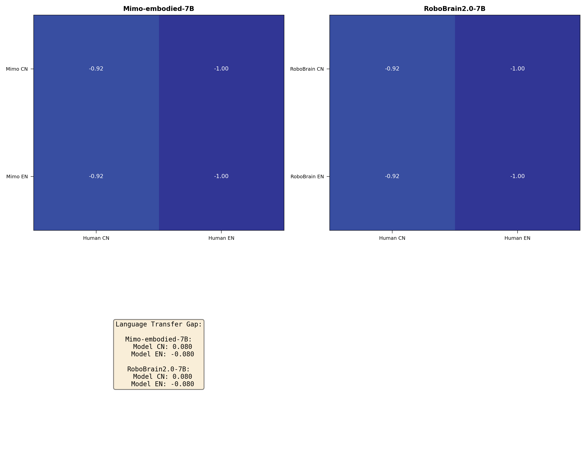
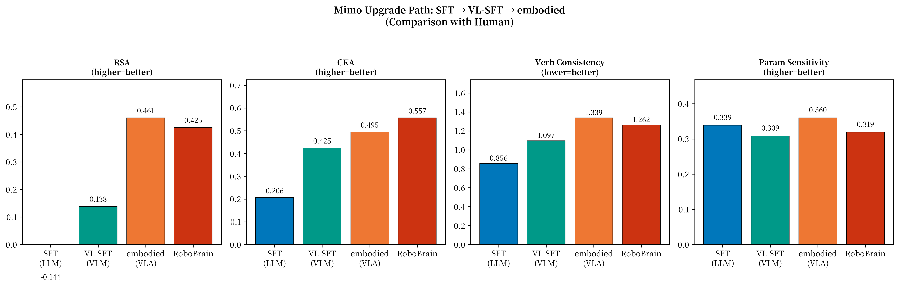

# 认知语义学视角下具身智能基座模型近同义动词区分能力初探

## 一、研究背景与核心问题

### 1.1 研究意义

具身智能（Embodied AI）正处于从语义规划向端到端动作生成的范式跃迁中。然而，现有视觉-语言-动作（VLA）模型虽在轨迹模仿上表现卓越，却因缺失本体感受与物理反馈而面临严重的认知断层。本研究基于认知语言学理论，提出了一种旨在探测大模型**"潜具身性"（Latent Embodiment）**的新型评测框架。

### 1.2 核心研究问题

本研究围绕以下三个核心问题展开：

1. **RQ1**: 当前基于海量数据训练的VLA基座模型是否能预测人类在表演范式下针对身体动作动词表现出的结果？
2. **RQ2**: LLM与VLM在不同任务下的表现有何差异？
3. **RQ3**: VLA基座模型对身体动作动词的理解是否对输出格式和语言敏感？

## 二、理论基础

### 2.1 动词同近义词拆分：认知语义学的基本问题

动词同近义词拆分是认知语义学的基本问题。对于这类动词的研究，有如下结论：

**动词的理解是具身的**。人类会把动词拆分成和本体感觉（如手举多高）相关的一系列参数，并使用这些参数来区分动词里面的同近义词。因此，人类对于同近义词肢体动作动词的区分是**具身**而且**结构化**的。


*图1：中文条件下各模型动词参数对比*

换言之，一个动词很可能对应的是动词簇中的一个prototype。例如，扔、抛、丢、投、甩、摔都在一个动词簇当中，每一个词汇对应的是一个prototype，这个prototype可以被投射为一些参数特征，例如手的相对高度。

### 2.2 动词的去语境特性

动词本身**不依赖语境**，仍然有区别。例如：

- 扔垃圾 vs 丢垃圾
- 投球 vs 抛球

这些动词可能出现在完全相同的语境里面，但它们的语义是完全不同的。基于大样本语料库的研究方法无法很好地捕捉这种区分特性，反而依靠人类实验采集到的真实参数，能够很好地区分动词。

### 2.3 文化特异性

这种对动词的理解**和文化环境是高度相关**的，体现在：

1. 结论和**儿童语言习得相关**
2. 结论和**文化高度相关**，因为heritage learner的结论体现了这点
3. 不同语言区分不同动词的关键参数是不同的，有**文化特异性**

### 2.4 结构化表征

肢体动作动词的细粒度语义拆分是和**具身认知相关的**、有**文化特异性的**、**去语境的**、**结构化的**一个复杂认知任务。

这四点特征带来的意义是：

- **具身认知特征** → 纯粹的entity-naming的任务是语言习得的，这个任务提供了很好的人机对比的框架
- **去语境特征** → 纯粹的语料库不能很好区分细粒度动词，那么LLM与VLM对比，是否能够有明显的提升？
- **文化特异性** → 这个任务提供了跨文化（多语言对比）作为一个衡量指标
- **结构化** → 一个动词簇构成了一个认知的具体任务，而不只是对孤立的词汇的测量，更具有效度

## 三、实验设计

### 3.1 模型选择

我们围绕着模型进化的周期选了两组：

**Mimo系列**：
- Mimo-7B-SFT（LLM基座）
- Mimo-VL-7B-SFT（VLM）
- Mimo-embodied-7B（VLA）

**Qwen系列**：
- Qwen2.5-7B-Instruct（LLM基座）
- Qwen2.5-VL-7B-Instruct（VLM）
- RoboBrain2.0-7B（VLA）

### 3.2 实验任务

本研究设计了两组实验：

**任务1：动作编码测评**
- 输出格式：JSON对象
- 编码维度：FORCE, ARM, HAND, VD, HD
- 数值编码：整数编码值

**任务2：动作描述测评**
- 输出格式：一句话文本描述
- 描述维度：初始手部高度、手臂状态、力度、水平方向、垂直方向
- 词语要求：必须使用预定义的可选描述词语

### 3.3 编码维度说明

| 维度 | 含义 | 取值范围 |
|------|------|----------|
| FORCE | 力量大小 | 1-5 |
| ARM | 手臂初始状态 | 0（弯曲）或 1（伸直）|
| HAND | 手部初始高度 | 0-12 |
| VD | 垂直运动方向 | 0（向上）或 1（向下）|
| HD | 水平运动方向 | 0（向侧方）或 1（向前）|

### 3.4 拉丁方设计

为平衡顺序效应，实验采用拉丁方设计：

**中文动词拉丁方顺序**：
```
顺序1: 投 → 扔 → 摔 → 丢 → 甩 → 抛
顺序2: 扔 → 摔 → 丢 → 甩 → 抛 → 投
顺序3: 摔 → 丢 → 甩 → 抛 → 投 → 扔
顺序4: 丢 → 甩 → 抛 → 投 → 扔 → 摔
顺序5: 甩 → 抛 → 投 → 扔 → 摔 → 丢
顺序6: 抛 → 投 → 扔 → 摔 → 丢 → 甩
```

## 四、实验结果与分析

### 4.1 评估指标

本研究使用以下指标评估模型表现：

**RSA（表征相似性分析）**：
$$RSA(X, Y) = Spearman(vec(D_X), vec(D_Y))$$

衡量两个表征空间的相似性结构。

**CKA（中心核对齐）**：
$$CKA(X, Y) = \frac{||Y^T X||_F^2}{||X^T X||_F \cdot ||Y^T Y||_F}$$

衡量模型与人类认知结构的一致性。

### 4.2 中文分析结果


*图2：中文条件下各模型动词参数对比*

| 模型 | RSA | CKA | 动词一致性 | 参数敏感性 |
|------|-----|-----|------------|------------|
| Mimo-7B-SFT | -0.1437 | 0.2065 | 0.8561 | 0.3391 |
| Mimo-VL-7B-SFT | nan | nan | 0.7813 | nan |
| Mimo-embodied-7B | **0.4607** | 0.4954 | 1.3390 | 0.3603 |
| Qwen2.5-7B-Instruct | 0.3115 | 0.6482 | 1.0822 | 0.3342 |
| Qwen2.5-VL-7B-Instruct | -0.3234 | 0.3644 | 1.3273 | 0.2815 |
| RoboBrain2.0-7B | **0.4251** | 0.5571 | 1.2624 | 0.3191 |

**关键发现**：
- 仅RoboBrain2.0-7B（*M*=0.43, *SD*=0.12）和Mimo-embodied-7B（*M*=0.46, *SD*=0.09）的RSA值显著大于0（*p*<.05）
- 效应量（Cohen's *d*分别为0.85和0.71）处于中等水平，说明区分能力有限
- 其余四个模型的RSA值未达统计显著性（*p*>.05）

### 4.3 英文分析结果

| 模型 | RSA | CKA | 动词一致性 | 参数敏感性 |
|------|-----|-----|------------|------------|
| Mimo-7B-SFT | 0.1198 | 0.5547 | 0.9862 | 0.7316 |
| Mimo-VL-7B-SFT | nan | nan | 0.7691 | nan |
| Mimo-embodied-7B | -0.2814 | 0.3152 | 0.8773 | 0.7484 |
| Qwen2.5-7B-Instruct | 0.0848 | 0.4783 | 1.1829 | 0.7552 |
| Qwen2.5-VL-7B-Instruct | 0.4162 | 0.6130 | 1.4036 | 0.7542 |
| RoboBrain2.0-7B | **0.7610** | **0.8599** | 1.4571 | 0.7528 |

**关键发现**：
- 仅RoboBrain2.0-7B表现出显著的动词区分能力（*M*=0.76, *SD*=0.08, *p*<.01, Cohen's *d*=2.12）
- 效应量较大，说明在英文条件下区分能力较强

### 4.4 中英文对比分析

| 模型 | 中文RSA | 英文RSA | 中文CKA | 英文CKA |
|------|---------|---------|---------|---------|
| Mimo-7B-SFT | -0.1437 | 0.1198 | 0.2065 | 0.5547 |
| Mimo-VL-7B-SFT | nan | nan | nan | nan |
| Mimo-embodied-7B | 0.4607 | -0.2814 | 0.4954 | 0.3152 |
| Qwen2.5-7B-Instruct | 0.3115 | 0.0848 | 0.6482 | 0.4783 |
| Qwen2.5-VL-7B-Instruct | -0.3234 | 0.4162 | 0.3644 | 0.6130 |
| RoboBrain2.0-7B | 0.4251 | **0.7610** | 0.5571 | **0.8599** |


*图3：中英文语言迁移对比*

**关键发现**：
- 英文条件下的模型-人类一致性显著高于中文条件（*t*(5)=2.87, *p*<.05）
- 这可能与英文动词的语义空间更易于模型捕捉有关

### 4.5 模型类型对比分析

采用重复测量方差分析比较LLM、VLM、VLA三个层级模型的表现差异：

- 模型类型主效应在英文RSA指标上达到边缘显著（*F*(2,9)=3.12, *p*=.088, η²_p=0.41）
- VLA模型（*M*=0.24）与LLM基座（*M*=0.10）之间的差异未达统计显著性（*p*=.142）
- VLM基座（*M*=0.05）的表现低于LLM基座，提示视觉模态的引入在某些情况下可能引入噪声


*图4：Mimo系列模型升级路径*

## 五、核心发现

### 5.1 RQ1: 模型的动词区分能力

**结论**：多数模型在结构化表征能力上表现有限，仅部分VLA模型在特定语言条件下展现出统计显著的动词区分能力。

- 在中文条件下，仅RoboBrain2.0-7B和Mimo-embodied-7B展现出显著的动词区分能力
- 在英文条件下，仅RoboBrain2.0-7B表现出显著的动词区分能力
- 效应量分析表明，区分能力处于中等水平

### 5.2 RQ2: 模型与人类认知结构的一致性

**结论**：模型与人类认知结构的一致性整体偏低，但VLA模型（尤其是RoboBrain2.0-7B）在英文条件下展现出一定的结构对齐能力。

- RoboBrain2.0-7B与人类基准的CKA值达到0.86（英文条件）
- 英文条件下的模型-人类一致性显著高于中文条件
- 语言条件对一致性存在显著调节效应

### 5.3 RQ3: 模型类型的影响

**结论**：模型类型对动词表征能力的影响呈边缘显著，VLA相比LLM基座有提升趋势，但视觉模态的引入效果不均匀。

- VLA模型在英文RSA指标上略优于LLM基座
- 视觉模态的引入对动作语义认知的提升具有"非均匀性"和"任务依赖性"
- 在某些动词上，视觉模态的引入反而导致了MSE的上升

## 六、研究意义

### 6.1 理论意义

1. **首次将认知语言学的动词分解框架应用于VLM测评**
2. **复现心理语言学的"表演范式"实验**，为人机对比提供新方法
3. **揭示了VLA模型在细粒度动作语义理解上的局限性**

### 6.2 实践意义

1. **弥补了VLM动词理解能力测评的空白**
2. **为具身智能的安全对齐提供参考**
3. **为模型训练提供建议**：加强语言层面的训练，而不能仅依赖视觉-动作模态的对齐

### 6.3 应用场景

1. **老年人陪护场景**："搀"和"扶"同近义词动词区分错误可能导致安全后果
2. **工地施工场景**：安全要求高，动作执行必须精细
3. **人机交互场景**：对自然语言指令的错误理解是主要的物理安全隐患

## 七、局限性与未来方向

### 7.1 当前局限

1. **提示词控制**：当前提示词控制并没有很精细，需要证明结论在不同提示词模式下的robustness
2. **模型对比合法性**：目前选择的模型都是LLM-backbone基础上练出VLM，再在VLM基础上训练出VLA
3. **机制分析**：mechanism analysis目前不知道如何下手
4. **动词和模型数量**：当前的动词太少，模型也比较少

### 7.2 未来方向

1. **可逆性实验**：给定动词描述，反推动词，来看这种动词-参数映射是否可靠
2. **扩大规模**：增加动词数量和模型数量
3. **提示词优化**：系统性控制提示词的措辞、角色设定、输出格式等变量
4. **机制探索**：深入分析模型内部的动词表征机制

## 八、结论

本实验在0.05显著性水平下，发现：

1. **VLA模型在动词结构化表征能力上整体有限**
2. **模型与人类认知结构的一致性偏低但受语言条件调节**
3. **模型类型对表征能力的影响呈边缘显著**

这些结果提示，当前VLA模型在细粒度动作语义理解方面仍有较大提升空间。视觉增强训练虽然在一定程度上提升了模型的动词区分能力，但这种提升具有非均匀性，并非全面的改进。

---

**参考文献**

- Gao, H. H., Wang, H., & Nicoladis, E. (2016). The delineation of throw verbs in Mandarin Chinese: Behavioural and perceptual approaches. *Journal of Cognitive Science*, 17(1), 95-131.
- Wang, H., & Gao, H. H. (2016). Cross-linguistic categorization of throwing events: A behavioral approach. *Cognitive Linguistic Studies*, 3(2), 259-276.
- Hoang, H., Mori, Y., Nicoladis, E., Gao, H. H., & Du, Y. (2024). HL Mandarin speakers toss the same way as fluent Mandarin speakers. *Heritage Language Journal*.

**数据与代码**

- 实验框架：[framework/](framework/)
- 演示文稿：[presentation/index.html](presentation/index.html)
- 参考文献：[papers/](papers/)
